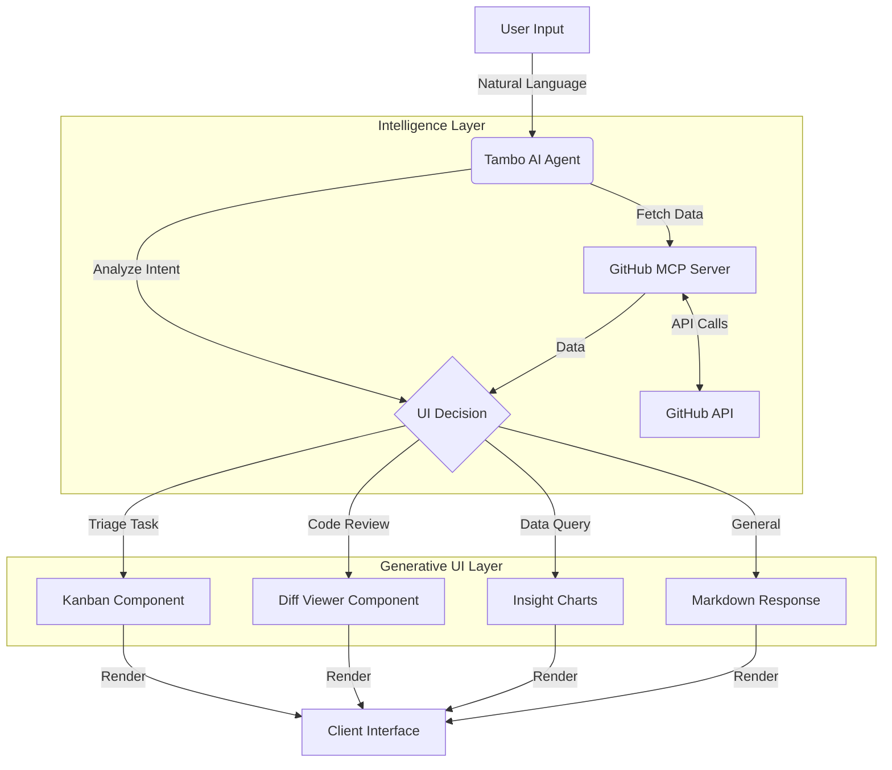

# GitHub Explorer x Tambo 🚀

<div align="center">
  

  **Master your repositories conversationally.**
  <br/>
  *Built for "The UI Strikes Back" Hackathon.*
  
  [**Demo**](#demo) · [**Features**](#features) · [**Architecture**](#how-it-works) · [**Setup**](#setup)
</div>

---

## 🤖 What is GitHub Explorer?

**GitHub Explorer** represents the next evolution of developer tools: **Generative UI**. 

Instead of navigating through static tabs for Issues, Pull Requests, and Insights, you simply **ask** for what you need. The application doesn't just reply with text; it **generates custom interactive interfaces** on the fly tailored to your specific intent.

Need to triage bugs? It builds a **Kanban Board** for you. Reviewing code? It spawns a **Diff Viewer**. Analyzing trends? It renders **Interactive Charts**.

## 🎥 Demo

https://github.com/user-attachments/assets/4af35274-7c53-42c7-b725-11622598ef28

## ✨ Features

- **🗣️ Natural Language Interface**: Chat with your codebase as if it were a senior engineer.
- **🎨 Generative UI**: The interface mutates based on context.
- **📋 Smart Issue Triage**: Instantly generate Kanban boards to categorize and manage issues.
- **🔍 Intelligent Diff Viewer**: Review Pull Requests with a side-by-side comparison tool generated on demand.
- **📊 Real-time Insights**: Visualize repository health, contributor stats, and activity trends.
- **🔐 Secure Integration**: Powered by Model Context Protocol (MCP) and fine-grained GitHub PATs.

## 🏗️ How It Works

### Generative UI Flow
The application uses **Tambo's AI** to determine the best way to represent data. It doesn't just "fetch" data; it "designs" the view.



### Technology Stack

| Layer | Technologies |
|-------|--------------|
| **Frontend** | Next.js 14, React, Tailwind CSS, Framer Motion |
| **AI & Logic** | Tambo SDK, Vercel AI SDK |
| **Data Protocol** | Model Context Protocol (MCP) |
| **Styling** | Lucide Icons, Glassmorphism Design System |

## 🚀 Getting Started

### Prerequisites

- **Node.js 18+** or Bun
- **GitHub Personal Access Token** (Fine-grained or Classic)
- **Tambo API Key**

### Installation

1. **Clone the repository**
   ```bash
   git clone https://github.com/nermalcat69/tambo-github-explorer
   cd tambo-github-explorer
   ```

2. **Install dependencies**
   ```bash
   npm install
   # or
   pnpm install
   ```

3. **Environment Setup**
   ```bash
   cp .env.example .env.local
   ```
   
   Fill in your secrets:
   ```env
   NEXT_PUBLIC_TAMBO_API_KEY=your_key_here
   GITHUB_TOKEN=your_github_pat_here
   ```

#### API Keys Setup

**Tambo API Key**

https://github.com/user-attachments/assets/ce0580cb-2049-4653-ac93-0ce406049818

1. Sign up on [Tambo](https://tambo.co)
2. Create a Project and then Generate an API Key

**GitHub Token Setup**

https://github.com/user-attachments/assets/db9ffe57-2e7e-4bd8-b63f-bf9ce9c9fdfa

1. Go to GitHub Settings > Developer settings > Personal access tokens(Fine-grained tokens)
2. Generate a new token.

4. **Run Locally**
   ```bash
   npm run dev
   ```
   Visit `http://localhost:3000` to start exploring.

## 💡 Usage Examples

| Intent | Prompt Example | Generated UI |
|--------|----------------|--------------|
| **Discovery** | "Show me 5 popular repos in the Vercel org" | Repo Cards Grid |
| **Triage** | "Organize the open bugs in facebook/react" | Interactive Kanban Board |
| **Review** | "Show me the changes in PR #123" | Split-View Code Diff |
| **Analysis** | "What's the commit activity like this week?" | Activity Line Chart |

## 🏆 Hackathon Context
This project was built for **The UI Strikes Back** hackathon (Feb 2-8, 2026). It demonstrates the power of escaping static workflows in favor of intent-driven dynamic interfaces.

---

<div align="center">
  <p>Star this repo if you find it useful!</p>
  <p>© 2026 Powered by Tambo AI</p>
</div>
